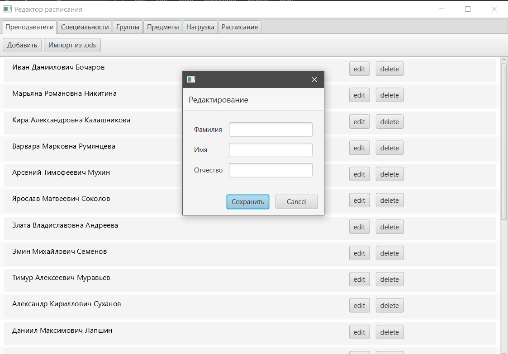
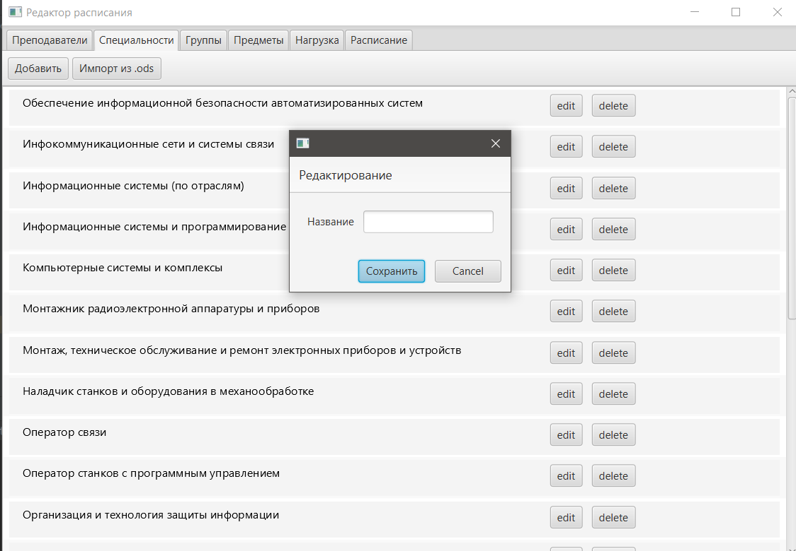
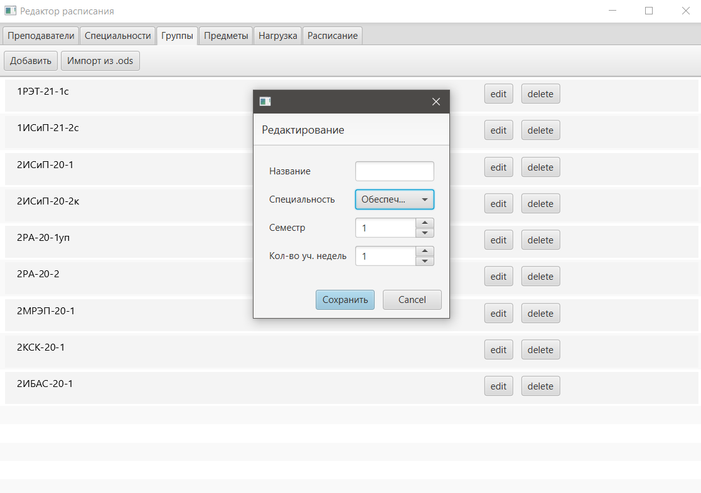
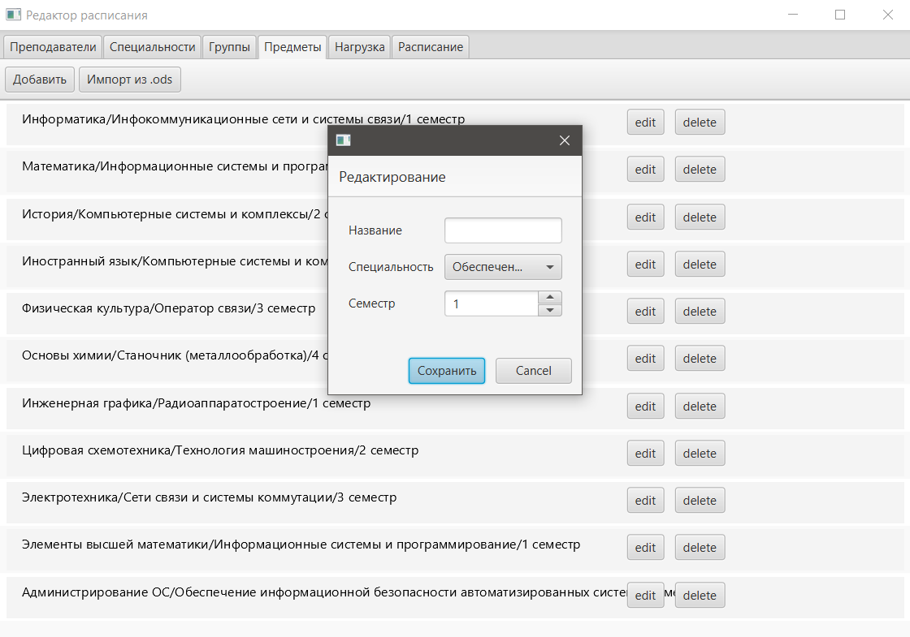
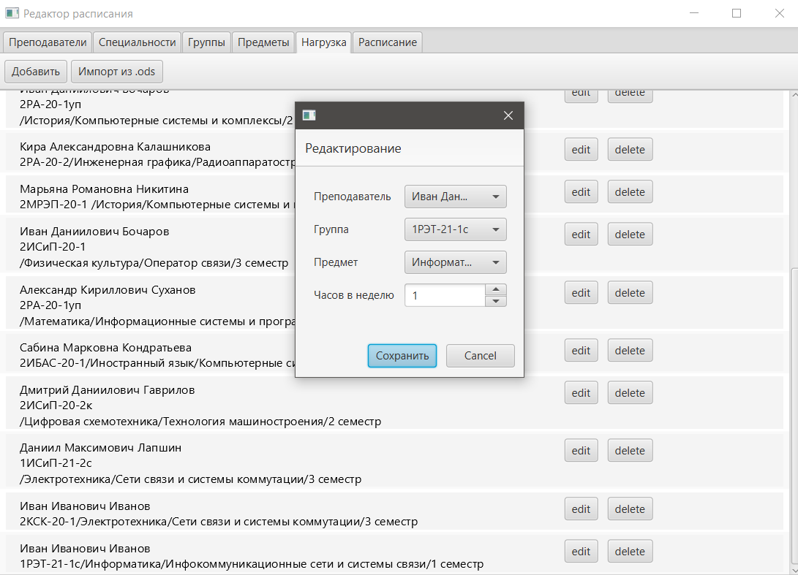
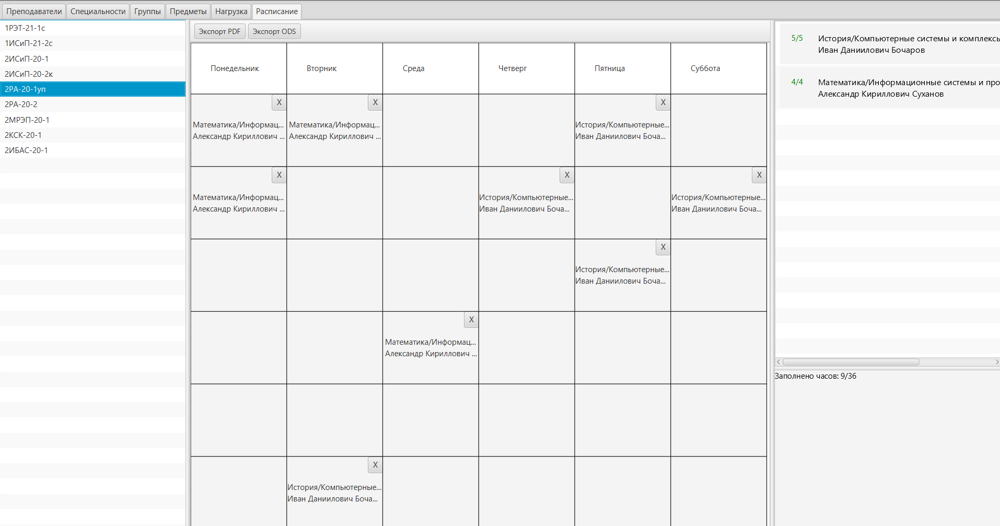
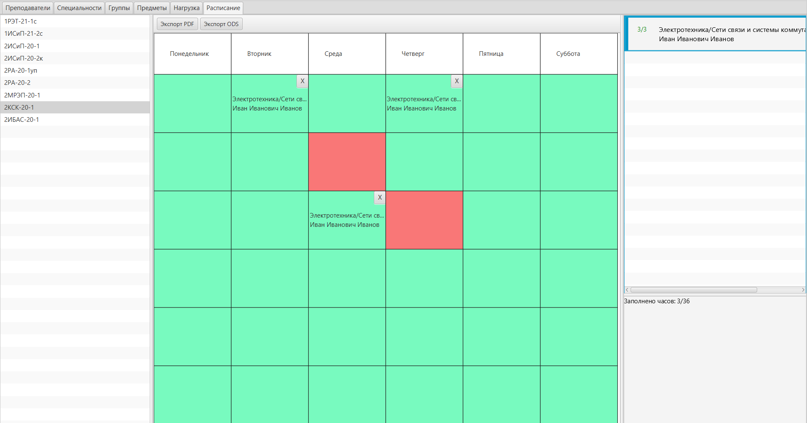
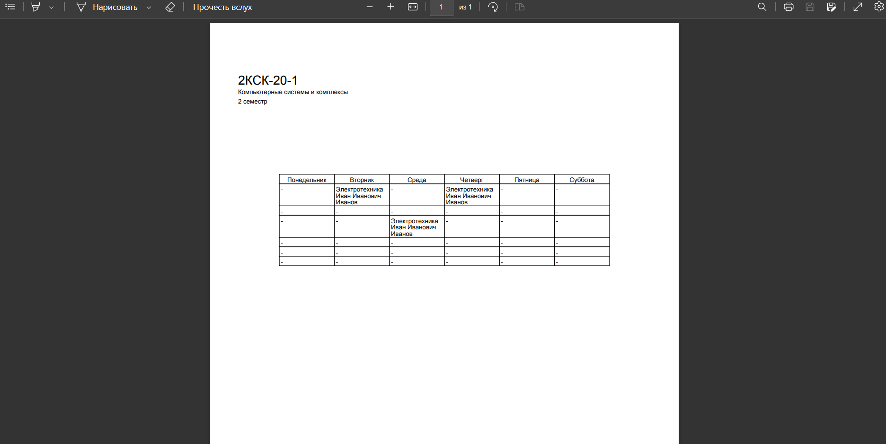
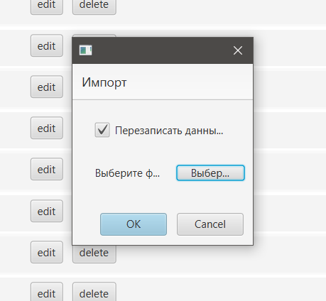

# TimetableApp
## Функции:
### Список преподавателей

### Список специальностей

### Список групп

### Список учебных предметов

### Список нагрузки с настройкой количества пар в неделю

### Редактор расписания с учетом часов в неделю и пересечений времени по преподавателям

### Экспорт расписания в PDF и ODS

### Импорт данных из ODS 

## Видео обзор на YouTube
https://youtu.be/26VYzNQwOP8
